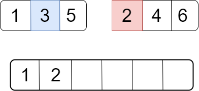

# Counting Inversions

**Инверсия массива** - эта пара элемнетов, которые расположены "вне естественного порядка". Это означает, что элемент, который в массиве встречается ранее, больше, чем тот, который встречается позже.

        ЗАДАЧА: ПОДСЧЕТ ИНВЕРСИЙ
        ------------------------
        Вход: массив A разных целых чисел
        Выход: количество инверсий - число пар (i, j) индексов массива, где i < j и A[i] > A[j]
        ------------------------

Этот алгоритм, как и сортировка слиянием относится к типу "разделяй и властвуй".

## Пример

Рассмотрим следующий массив:

В этом массиве 4 инверсии, так как в "вне естественного порядка" такие пары: (5,3), (5,2), (5,4), (3,2).

## Поиск полным перебором

Это метод грубой силы.

        ПОЛНЫЙ ПЕРЕБОР ДЛЯ ПОДСЧЕТА ИНВЕРСИЙ
        ------------------------
        Вход: массив A разных целых чисел
        Выход: количество инверсий 
        ------------------------
        numInv := 0
        for i := 1 to n - 1 do
            for j := i + 1 to n do
                if A[i] > A[j] then
                   numInv := numInv + 1
        return numInv

## Подход разделяй и властвуй

Для начала отнесем инверсии массива A длинной n к одному из типов:

- *Левая инверсия*: инверсия, в которой оба индекса, *i, j* находятся в пер­вой половине массива 
(то есть *i, j* <= n/2).

- *Правая инверсия*: инверсия, в которой оба индекса, /, у, находятся во второй половине массива 
(то есть *i, j* > n/2).

- *Разделенная инверсия*: инверсия, в которой i находится в левой полови­не, а у в правой половине 
(то есть *i* <= n/2 < *j*).

Например, в нашем массиве:

(5,3) - левая инверсия (инверсия в левой половине)
(5,2), (5,4), (3,2) - разделенные инвресии (один символ в левой части, второй - в правой)      

Движущая идея состоит в том, чтобы разработать наш рекурсивный алго­ритм подсчета инверсий таким образом, чтобы он задействовал алгоритм **MergeSort**. Это требует от наших рекурсивных вызовов большего ради того, 
чтобы облегчить подсчет количества разделенных инверсий. 
Каждый рекурсивный вызов будет отвечать не только за подсчет количества инверсий в массиве, который ему передан, но и за возврат отсортированной версии массива.

        SORT-AND-COUNTINV
        ------------------------
        Вход: массив A разных целых чисел
        Выход: отсортированный массив В с теми же самыми целыми числами и количество инверсий массива A. 
        ------------------------
        if n = 0 or n = 1 then
            return (A,0)
        else
            (C, leftInv) := Sort-and-CountInv(первая половина А)
            (D, rightInv) := Sort-and-CountInv(вторая половина А)
            (B, splitInv) := Merge-and-CountSplitInv(C, D)
        return (B, leftInv + rightInv + splitInv)

Это псевдокод подпрограммы Merge-and-CountSplitInv

        MERGE
        ------------------------
        Вход: отсортированные массивы C и D (длинной n/2 каждый)
        Выход: отсортированный массив В (длинной n)
        Упрощающее допущение: n - четное 
        ------------------------
        i := 1, j := 1, splitInv := 0
        for k := 1 to n do
            if C[i] < D[i] then
               B[k] := C[i], i := i + 1
            else
               B[k] := D[j], j := j + 1
               splitInv := splitInv + (n/2 - i + 1) // количество оставшихся элемнетов в С
        return (B, splitInv)

### Как это решает задачу?

Рассмотрим на примере последнего рекурсивного вызова, когда функция вернет готовый массив.

Здесь, когда цифра из левой половины больше цифры правой половины, мы добавим количество оставшихся цифр в подмассиве С к числу инверсий (тоесть +2 [инверсии (3,2),(5,2)])

## Время исполнения

Во-первых, каждый вызов алго­ритма делает два рекурсивных вызова. Во-вторых, длина входных данных делится пополам с каждым уровнем рекурсии. В-третьих, объем операций, выполняемых в рекурсивном вызове, не считая операций, выполняемых по­следующими рекурсивными вызовами, линейно зависит от размера входных данных.

Соответвенно, для этого алгоритма временная граница O(*n* log*n*)
